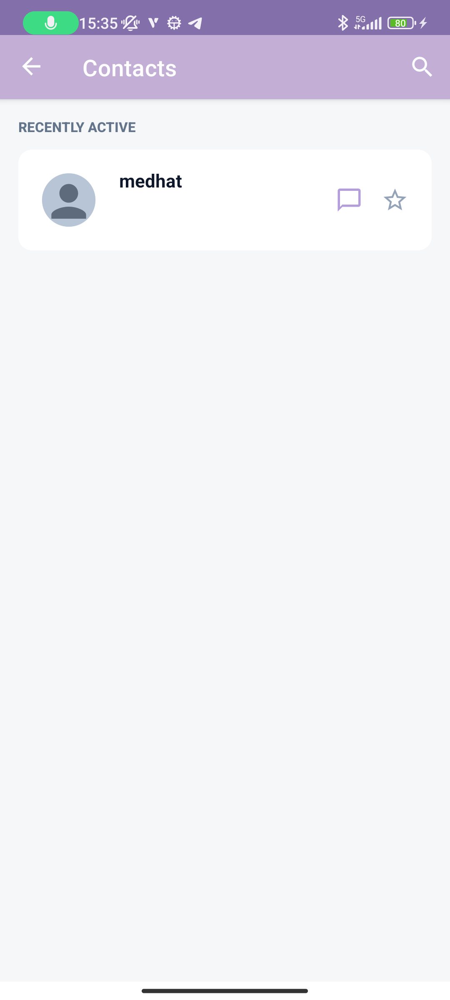

# Our Chat

A modern Android chat application with real-time messaging, push notifications, and support for audio messages, image sharing, and file sharing. Built with Kotlin and following MVVM architecture patterns.

## Setup Instructions

### Prerequisites
- Android Studio Hedgehog (2023.1.1) or later
- JDK 17 or later
- Android SDK 34
- Firebase project

### Configuration

#### 1. Firebase Setup
1. Create a Firebase project at [Firebase Console](https://console.firebase.google.com/)
2. Add an Android app to your Firebase project
3. Download the `google-services.json` file
4. Place `google-services.json` in the `app/` directory
5. **Configure Firestore Security Rules**:
   - Go to Firebase Console > Firestore Database > Rules
   - Deploy the security rules from `firestore.rules` file in this project
   - The rules allow authenticated users to:
     - Read any user document
     - Create/update/delete their own user document
     - Read/create/update/delete messages they are part of
   - **Important**: Without proper security rules, the app will crash with permission errors


### Building the Project

1. Clone the repository
2. Open the project in Android Studio
3. Sync Gradle files
4. Ensure all prerequisites are met
5. Add `google-services.json` to the `app/` directory
6. Build and run the project


## Technology Stack

### Architecture & Design Patterns
- **MVVM (Model-View-ViewModel)** - Clean architecture pattern
- **Single Activity Architecture** - Multiple fragments with Navigation Component
- **ViewBinding & DataBinding** - Type-safe view references and declarative layouts
- **Lifecycle-Aware Components** - AndroidX Lifecycle 2.7.0

### Libraries & Frameworks
- **AndroidX Navigation 2.7.7** - Type-safe navigation with Safe Args
- **Material Design Components 1.11.0** - Modern Material 3 UI components
- **AndroidX Lifecycle 2.7.0** - ViewModel, LiveData, and lifecycle management
- **Glide 4.16.0** - Image loading and caching
- **EventBus 3.3.1** - Event-driven communication
- **Gson 2.10.1** - JSON serialization
- **Dexter 6.2.3** - Runtime permissions handling

### Firebase Services
- **Firebase Authentication** - Email/password authentication
- **Cloud Firestore** - Real-time NoSQL database
- **Firebase Storage** - File and media storage
- **Firebase Cloud Messaging (FCM)** - Push notifications
- **Firebase Analytics** - User analytics and insights
- **Firebase Crashlytics** - Crash reporting and monitoring
- **Firebase BoM 32.8.0** - Dependency version management

### Android System Services
- **Download Manager** - File downloads
- **Media Recorder** - Audio recording
- **Notification Manager** - Push notifications

## Features

| Feature | Description | Screenshots |
|---------|-------------|-------------|
| **Messages List** | View all your conversations in one place with real-time updates |  |
| **Chatting** | Send and receive messages in real-time with rich media support |  |
| **User Profile** | Update your profile information and pictures from camera or gallery |  |
| **Find Friends** | Search for users to connect with |  |
| **Incoming Friend Requests** | View and manage friend requests from other users |  |
| **Contacts List** | Access your contacts and start conversations |  |

## Project Structure

```
app/src/main/java/com/ganainy/ourchat/
├── data/
│   └── model/          # Data models (User, Message, ChatParticipant, etc.)
├── service/             # Background services (FCM, etc.)
├── ui/                  # UI components organized by feature
│   ├── chat/           # Chat functionality
│   ├── contacts/       # Contacts management
│   ├── findUser/       # User search and discovery
│   ├── home/           # Home screen with chat previews
│   ├── login/          # Authentication
│   ├── profile/        # User profile management
│   └── ...
└── Utils/              # Utility classes and helpers
```

## Minimum Requirements

- **Minimum SDK**: 23 (Android 6.0 Marshmallow)
- **Target SDK**: 34 (Android 14)
- **Compile SDK**: 34

